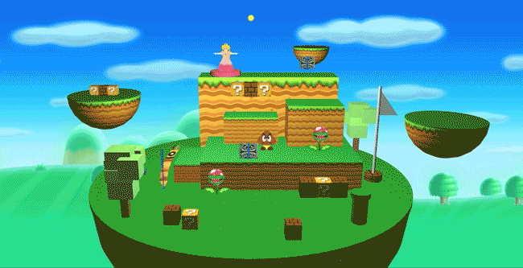

# Collection of projects done for UBC's computer graphics and animation course
Key Frame Animations with uses of Bezier and Catmull-Rom Curves:

Key Frame Animations:

Texture Mapping:

Ray Casting:

